# ↓↓↓整理的Ext.js（版本6.0）一些简单使用示例以及效果↓↓↓

---

## box 弹出框
- 最基础弹出框 [box-basic](ExtJs/box/box-basic.html)   
- confirm [box-confirm](ExtJs/box/box-confirm.html)   
- multiline [box-multiline](ExtJs/box/box-multiline.html)   
- prompt [box-prompt](ExtJs/box/box-prompt.html)   
- yesorcancel [box-yesorcancel](ExtJs/box/box-yesorcancel.html)   

## chart 画图
- 区域图 [chart-area](ExtJs/chart/chart-area.html)   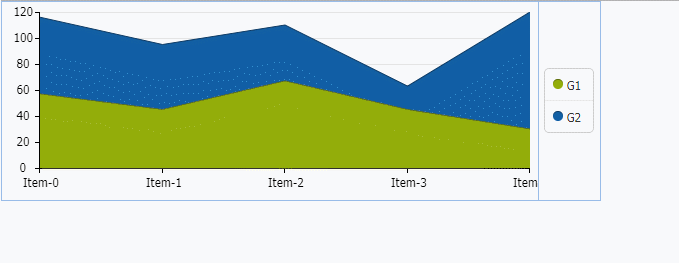
- 条形图 [chart-bar](ExtJs/chart/chart-bar.html)   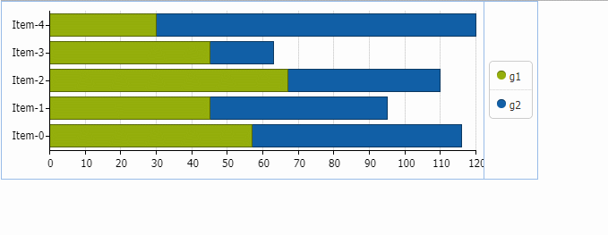
- 线形图 [chart-line](ExtJs/chart/chart-line.html)   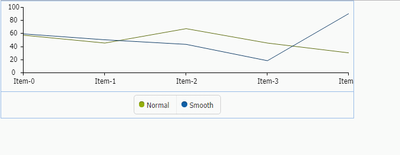
- 饼图 [chart-pie](ExtJs/chart/chart-pie.html)   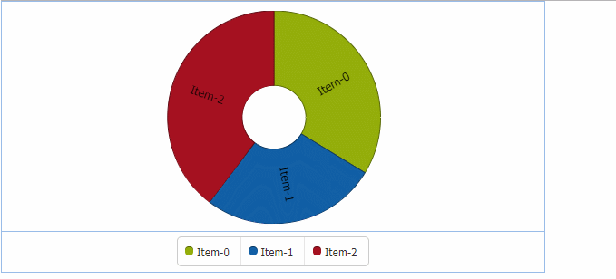

## Drag and drop 拖放
- 网格到表单 [DD-gridtoform](ExtJs/DD/DD-gridtoform.html)   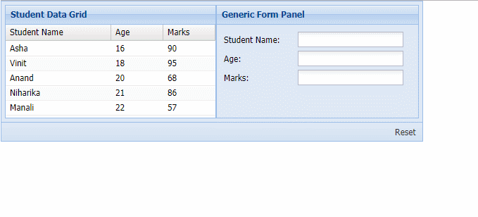
- 网格到网格 [DD-gridtogrid](ExtJs/DD/DD-gridtogrid.html)   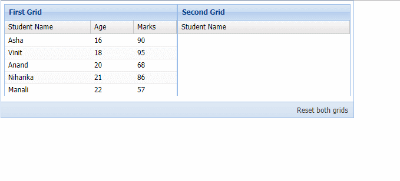

## draw 图像
- 弧形 [draw-arc](ExtJs/draw/draw-arc.html)   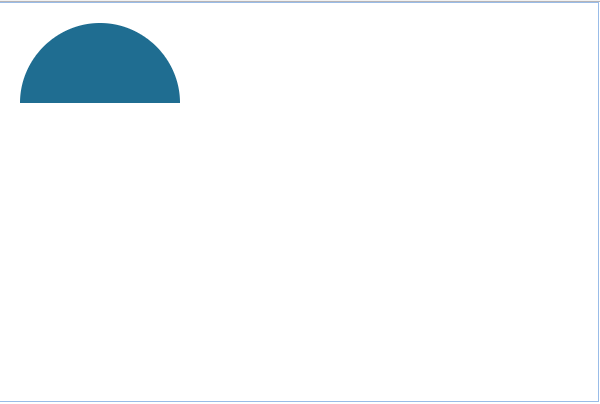
- 圆形 [draw-circle](ExtJs/draw/draw-circle.html)   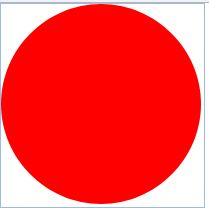
- 椭圆形 [draw-ellipse](ExtJs/draw/draw-ellipse.html)   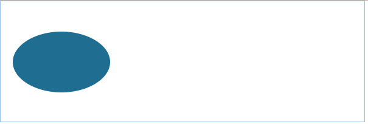
- 椭圆弧形 [draw-ellipticalArc](ExtJs/draw/draw-ellipticalArc.html)   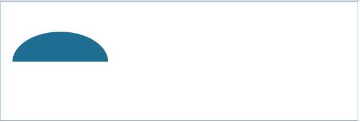
- 正方形 [draw-square](ExtJs/draw/draw-square.html)   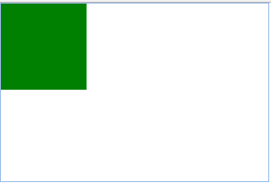
- 图形添加图像 [draw-image](ExtJs/draw/draw-image.html)   
- 创建freepath [draw-path](ExtJs/draw/draw-path.html)   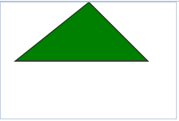
- 创建绘图的矩形形状 [draw-rect](ExtJs/draw/draw-rect.html)   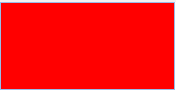
- 旋转绘图 [draw-rotate](ExtJs/draw/draw-rotate.html)   
- 绘制文本 [draw-text](ExtJs/draw/draw-text.html)   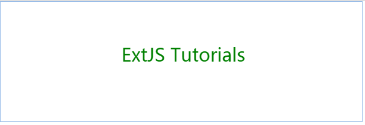
- 转化 [draw-translate](ExtJs/draw/draw-translate.html)   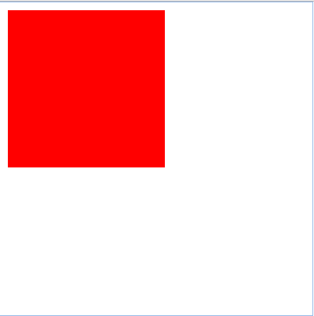

## layout 布局
- 绝对布局 [draw-arc](ExtJs/layout/layout-absolute.html)   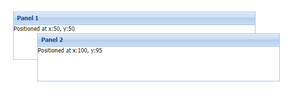
- 手风琴布局 [layout-accordion](ExtJs/layout/layout-accordion.html)   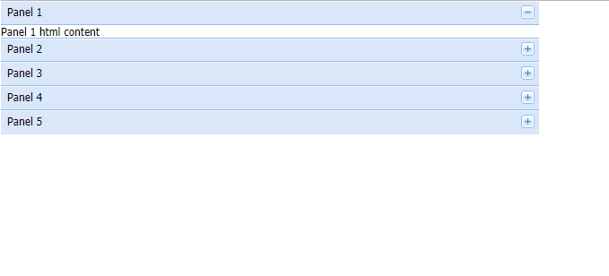
- 锚点布局 [layout-anchor](ExtJs/layout/layout-anchor.html)   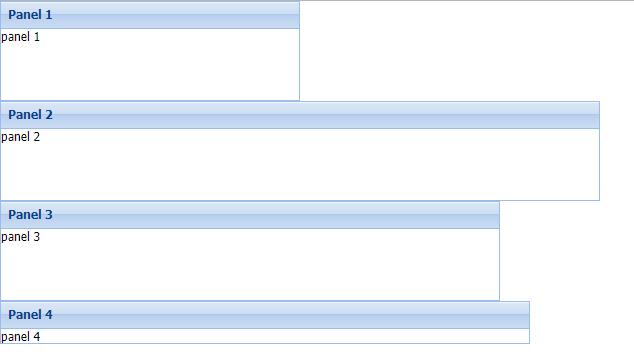
- 自动布局 [layout-auto](ExtJs/layout/layout-auto.html)   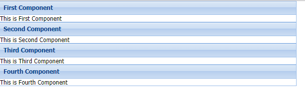
- 边框布局 [layout-border](ExtJs/layout/layout-border.html)   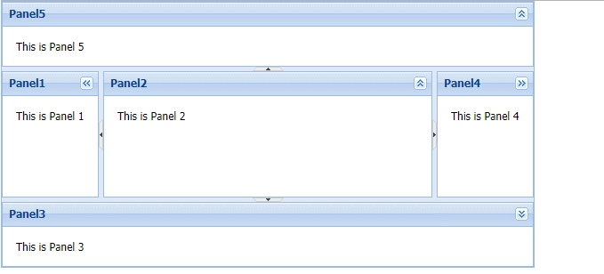
- card布局 [layout-card](ExtJs/layout/layout-card.html)   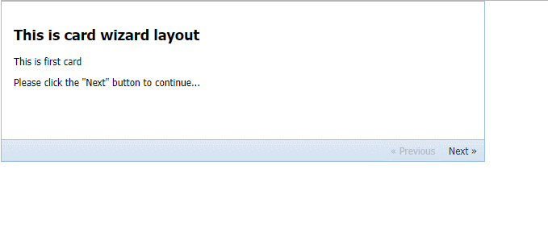
- cardtabs布局 [layout-cardtabs](ExtJs/layout/layout-cardtabs.html)   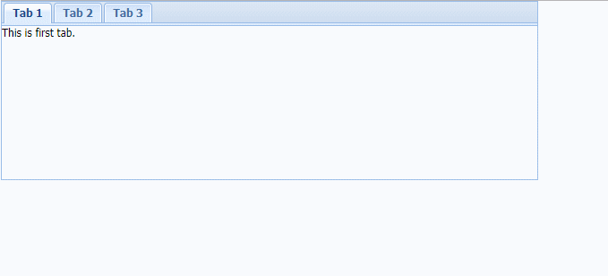
- 列布局 [layout-column](ExtJs/layout/layout-column.html)   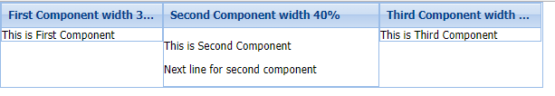
- 适合布局 [layout-fit](ExtJs/layout/layout-fit.html)   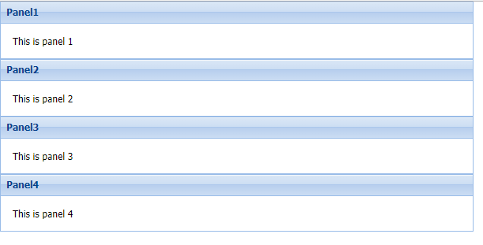
- hbox布局 [layout-hbox](ExtJs/layout/layout-hbox.html)   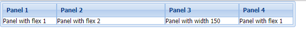
- 表布局 [layout-table](ExtJs/layout/layout-table.html)   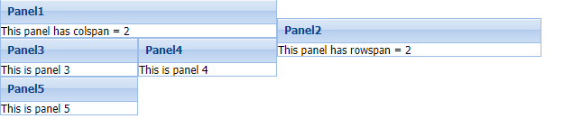
- vbox布局 [layout-vbox](ExtJs/layout/layout-vbox.html)   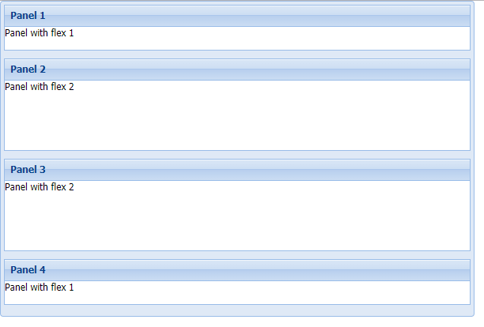

## panel 面板
- 表单面板 [panel-form](ExtJs/panel/panel-form.html)   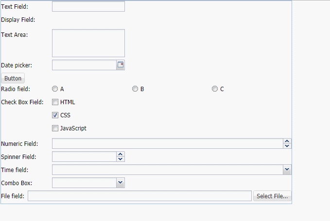
- 网格面板 [panel-grid](ExtJs/panel/panel-grid.html)   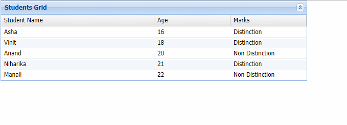
- 子面板 [panel-panel](ExtJs/panel/panel-panel.html)   
- tab面板 [panel-tab](ExtJs/panel/panel-tab.html)   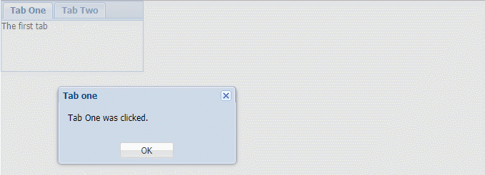

## Container-Component 容器组件
- 容器组件 [Container-Component](ExtJs/Container-Component.html)   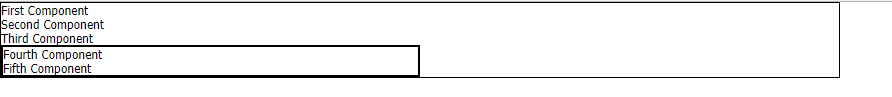

## Data 数据
- 数据 [Data](ExtJs/Data.html)

## event 事件
- 事件 [event](ExtJs/event.html)   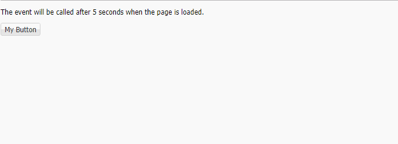

## HTML编辑器
- HTML编辑器 [HtmlEditor](ExtJs/HtmlEditor.html)   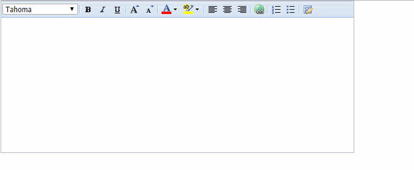

## progress bar 进度条
- 进度条 [progress-bar](ExtJs/progress-bar.html)   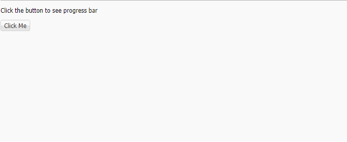

## Viewport
- Viewport [Viewport-container](ExtJs/Viewport-container.html)   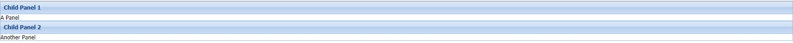

## Window 窗口
- 窗口 [Window](ExtJs/Window.html)   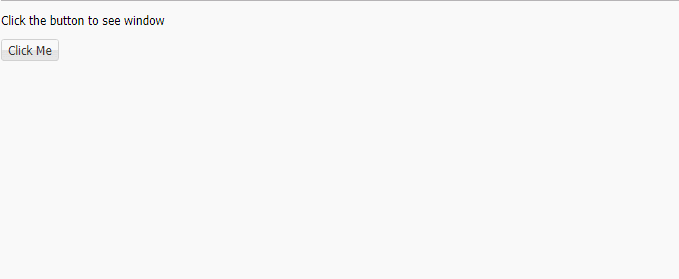
