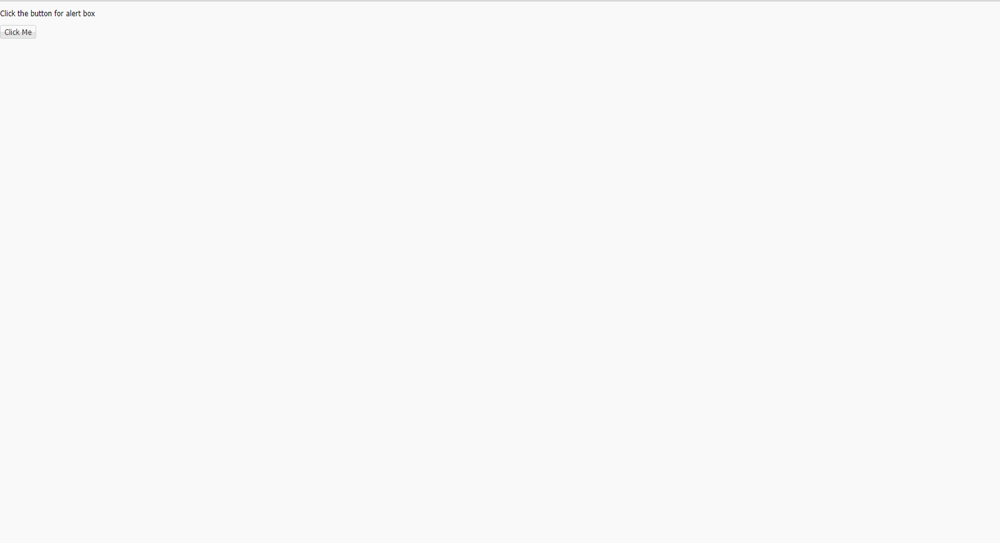
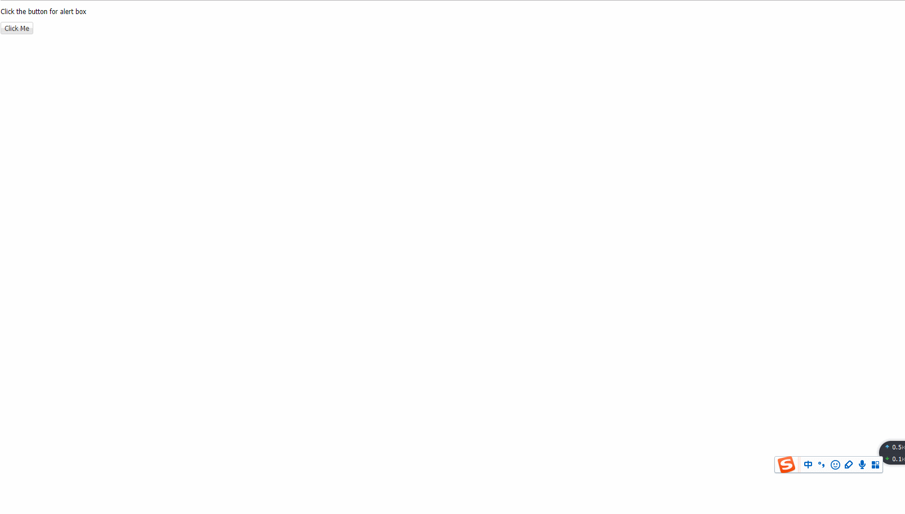
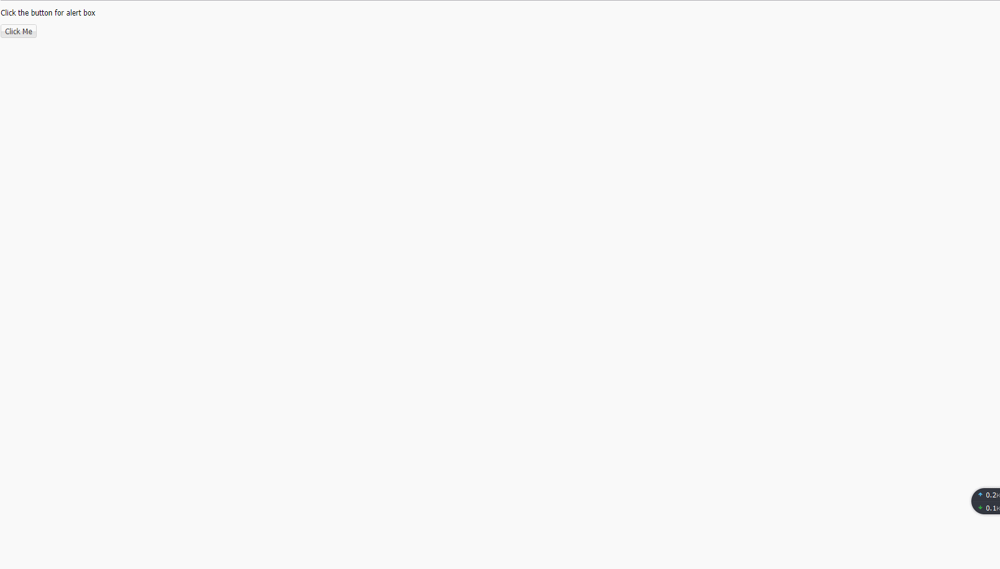
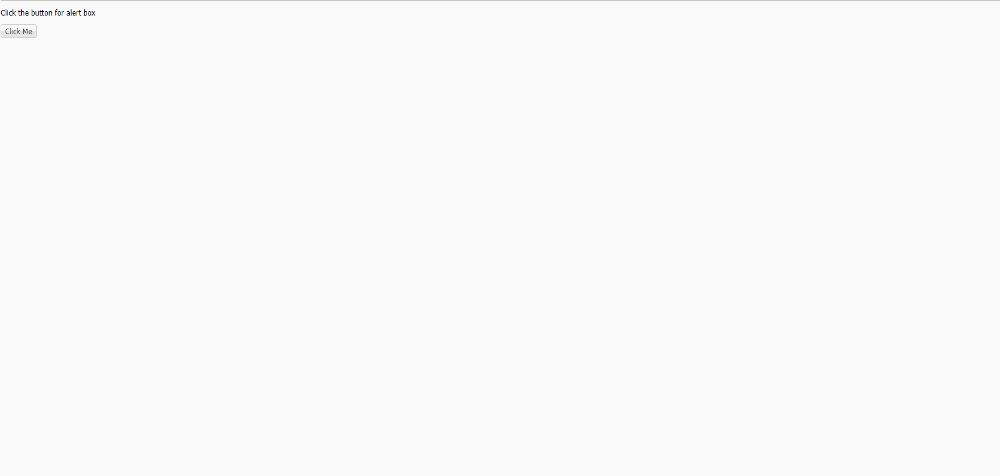

# ↓↓↓整理的Ext.js（版本6.0）一些简单使用示例以及效果↓↓↓

---
## 弹出框
- 最基础弹出框 [box-basic](ExtJs/box/box-basic.html) 
- confirm [box-confirm](ExtJs/box/box-confirm.html) 
- multiline [box-multiline](ExtJs/box/box-multiline.html) 
- prompt [box-prompt](ExtJs/box/box-prompt.html) 
- yesorcancel [box-yesorcancel](ExtJs/box/box-yesorcancel.html) 